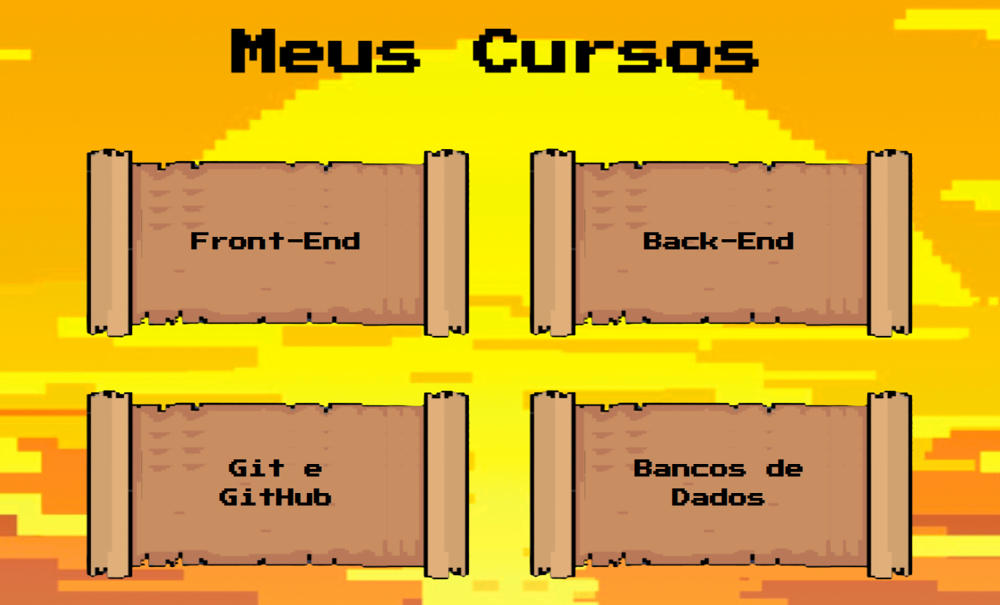

<div align="center">
  <a href="README.md">
    
  </a>
  <a href="README_en.md">
    
  </a>
  <a href="README_sp.md">
    
  </a>
</div>

<br>

<!-- Encabezado de presentación -->
<h1 align="center">
    <!-- Nombre del proyecto -->
    <p>DevWay</p>
    <!-- Logotipo del proyecto -->
    
</h1>

<br>

<!-- Presentación de la plataforma -->
<h2 align="center">
    Presentación
</h2>
<!-- GIF de presentación -->


<br>

<!-- Dirección del sitio web -->
<!-- <h2 align="center"><a href="">Próximamente en...</a></h2> -->

<br>

<!-- Enlaces útiles -->
## 🔗 Enlaces
- [Documentación](https://docs.google.com/document/d/1Rs7qrebyRe5CqEBB9wxDN2wHQxvrq_WX7Age8zAB-Ug/edit?pli=1)
- [Proyecto](https://github.com/guisilvas/CodeBreakers-Devway)
- [Dirección]()

<br>

<!-- Acerca del proyecto -->
## 📄 Acerca de
<p style="text-align: justify">
El proyecto Devway es una plataforma con rutas de aprendizaje en programación, dirigida a principiantes en el campo de la Tecnología de la Información. El sitio web presenta trayectorias de aprendizaje para los principales campos de desarrollo: Frontend, Backend, Análisis de Datos, y Git y GitHub. Desarrollado en HTML, CSS, JavaScript y PHP, cuenta con un diseño limpio e intuitivo, así como funcionalidades accesibles, para proporcionar la mejor experiencia de programación posible al usuario.
</p>

<br>

<!-- Herramientas y tecnologías utilizadas -->
## 🔨 Herramientas

<br>

- Metodología ágil
    - [Extreme Programing](https://www.agilealliance.org/)

<br>

- Organización
    - [Azure](https://azure.microsoft.com/)
    - [Trello](https://trello.com/create-first-team)

<br>

- Frontend
    - [HTML](https://www.w3.org/TR/html/)
    - [CSS](https://www.w3.org/TR/html/)
    - [JavaScript](https://developer.mozilla.org/docs/Web/JavaScript/Guide)
    - [Bootstrap](https://getbootstrap.com/)

<br>

- Backend
    - [PHP](https://www.php.net/)

<br>

<!-- Objetivos del proyecto -->
## 🎯 Objetivo

 <p style="text-align: justify">
El objetivo principal del proyecto es poner en práctica los conocimientos adquiridos en el módulo de Calidad del Software y Experiencia del Usuario, así como aplicar los conocimientos de metodologías ágiles junto con los módulos previos de Desarrollo Web.
 </p>

<br>

## ⚡ Contribuir

```bash
    # Clonar el repositorio
    git clone https://github.com/guisilvas/CodeBreakers-Devway
```

<br>

## 👷‍♂️ Colaboradores

- Profesor: [Felipe de Paula](https://github.com/depaulaio)

<br>

- Desarrolladores

    - [Anny Duarte](https://github.com/Muniz-DuarteAnny)
    - [Bruna Gontijo](https://github.com/brunagtmaia)
    - [Bruno Santana]()
    - [Breno Gomes](https://github.com/brngom3s)
    - [Douglas Lima](https://github.com/DOzinhaha)
    - [Eduarda Leandra](https://github.com/DudaLeandra)
    - [Gabriel Mendonça](https://github.com/Gabriel037)
    - [Guilherme Silva](https://github.com/guisilvas)
    - [Henrique Rios](https://github.com/hriquerios)
    - [Luzia Rodrigues](https://github.com/Luziarcmuniz)
    - [Pablo Soares](https://github.com/PabloSoares1572)

<br>

---

<br>

<p align="center">por DIV/DEV/1M</p>